# JanusAB
A Drupal 8 module to make use of the [Janus AB library](https://bitbucket.org/synetic/janus-ab-lib).  
The Drupal module provides both service definitions of the library's classes, and offers utility classes to make use of the 
classes found within the library. It also adds the ability to configure the framework through configforms.  

Due to the nature of Drupal, it is not possible for the module to allow fully configured AB-testing without developer
input. If you are not capable of writing the code required to implement the right theming hooks, it is highly recommend to
**not** use this module on your site.

## Installation
Install using composer.
```
composer require synetic/janus-ab ^1.0.0
```

## Key concepts
The following key concepts should be kept in mind while running AB-tests using the Janus module.

### AB-testing
AB-testing involves the concept that changes to a website should be made based on data, instead of intuition alone.
This is done by splitting incoming users into different flows. Each flow is presented with changes on either a single 
or multiple pages.
Data is then gathered when users hit a page that has variations on it and when users complete a goal.  
These goals vary based on a sites goals and targets.  
For example, blogging sites may create goals like "A user signs up for the mailing list".
E-commerce sites may create more monetary based goals such as: "A user buys a product".

This data is gathered by doing experiments. Each experiment defines it's start- and end date, and has a few variations
used in the experiment.
Furthermore, an experiment must relate to a goal, and target a specific element of a website.

An example experiment for may be the following:

**Premise:**
> A webshop has the call to action "Buy our stuff, its cool!", but their marketing department suspects that this 
is not the best. Sales are going up, but too slowly, and management is not happy.
The department proposes to change their call to aciton to: "Buy our stuff, its awesome!" That will surely improve sales! 

The proposed experiment here is to *change the call to action*.  
Within this experiment, we can identify two variations for the call to action.   
The first variation is always the control, or the original. In this case it is: "Buy our stuff, its cool!" 
We call this one 'A'.   
The second variation is our proposed change, "Buy our stuff, its awesome!" This one will be called 'B'.

Experiments should generally run for at least one business cycle (often a full week including weekend). 
This is to ensure that coincidental environment factors have less impact on the results of the test. 

After the experiments are prepared and set up using this module, data is logged whenever users interact with the 
experiment.  
This means that whenever a user visits the home page they are served with either the A or B variation.
The users then do as they usually do, navigating the site and shopping around. When a user completes their order, 
we log the success for their variation.

If 100 users interact with the site in our business cycle, we may end up with the following results:

|              | A   | B   |
|--------------|-----|-----|
| Traffic      | 50  | 50  |
| Success      | 15  | 25  |
| Success rate | 30% | 50% |

This shows that the marketing department was right, the B variation has a 66.66% increase in performance when compared
to the original.

Based on this data, the company can then implement the variation, enjoying an increase in sales!
 
**This sounds lovely, but there are some pitfalls involved in running AB-tests!**

### Keep it small
The first mistake many novice AB-testers make is to test everything at once!
You should attempt to keep your tests relatively small. That means that you should not make an excessive
amount of variations.
   
The main reason for this is that even if the changes are successful, we get confusing insights into what the cause of 
the improvement actually was. A chance exists that the layout change was terrible, and reduced the conversion rate 
by 10%, but the changed call to action increased conversion rates by 100%.  
This means that while we can see that our conversion rate has increased by 90%, we may erroneously believe that it is 
due to our layout changes. If we then apply the same layout to the rest of our site, conversions may drop dramatically
even though our previously gathered data seems to back up the choice to change the layout.

A guideline to follow here is to only have your experiment affect a single part of your website.  
This means that within an experiment you should make changes like:
- Restructure the layout of your home page.
- Change the call to action
- etc.

If you're changing a flow, try to ensure that pages in this flow maintain the same look and feel to avoid confusing
users.
> Change the call to action OR the layout of your page. But not both!

### Don't cut the experiment short
One of the most tempting things for most people that see that a variation has a much higher conversion rate after a  few
days of running the test is to stop the test and implemented the "better" variation.  
This is a bad thing. There are several reasons that the usual recommendation is to run an experiment for at least one 
business cycle.

**Impact of weekdays**

Companies sell more on different days. The impact of the day of the week can be
[huge](https://www.richrelevance.com/blog/2012/08/27/monday-matters-how-day-of-week-affects-online-shopping-for-four-major-retailers/)!
This means that anyone who runs an experiment on their site that does not last for a full business cycle risks having
their experiment contaminated by environmental factors. While it is possible to run for less than a business cycle, the 
general recommendation is to run an experiment for at least two weeks.

**Regression towards the mean.**

Because users are presented with randomly chosen variations, it is possible for one variation to appear much better at
the start of the experiment, simply because those users who would create a conversion regardless of any changes were
mostly placed into that variation.  
Over time this stabilizes. This reduction of chance over time is called "Regression towards the mean".

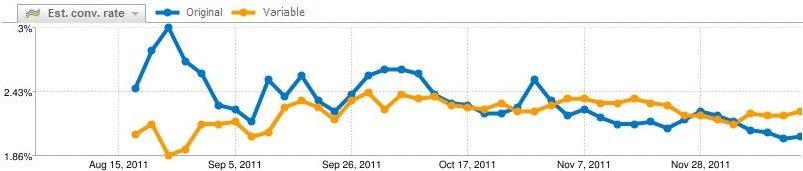  
[Source](https://instapage.com/blog/validating-ab-tests)  

In the example image we see that the original initially appeared to perform much better than the variation,
but once time had passed, the variation ended up as the better choice.
If this is not taken into account, it is possible that a variation will be chosen that 
appears better at first, but actually performs much worse than the original. 

> To account for regression towards the mean, it is important to let experiments run for a while.

### No concurrent experiments
Similar to keeping it small, running several experiments on the same site at the same time will have a high likelihood
of introducing contamination between experiments. Especially if these experiments are part of the same user journey
through the site. If one experiment focuses on changing the homepage, and another on changing the checkout process
for a webshop, there can be no guarantee that either experiment is the cause of conversion increases.  
In this case, there existence of multiple experiments in the same user journey ensures that neither experiment will
get us useful data. 

You may believe that this can easily be solved by simply running experiments on different parts of your website. 
After all, if they are not part of the same user journey, it shouldn't be a problem! 

However, users may interact across several user journeys in the site within a single session. This means that they can
easily go from reading blog articles to trying to order a product, which would ordinarily be placed in different 
user journeys.  
Because of this even experiments that do not seem to conflict will often introduce cross-contamination
of results.

> Do not run multiple experiments concurrently!  

### High traffic pages first
The reason to even start doing AB-testing is because we want to make design decisions based on data. 
Furthermore the end result we're looking for is to have improved conversion rates.  
Whether this means that we have an incredible amount of email subscriptions, 
or just a massive amount of daily sales, the end goal is to improve conversion.

The careful marketeer will often want to try out a process like AB-testing first to see if it can be utilized correctly.
This leads to them implementing an experiment for a part of the site that is not often visited.
After all, if we screw up the home page it will be disastrous for our conversion! 
This line of thinking is wrong. When implementing AB-tests, we always want to start with our high traffic pages, as this 
is where the user's decisions are most affected. 
Especially pages that don't just have high traffic, but also a high bounce rate are ideal targets for improvement.

Once these pages have been fully optimized, or at least optimized quite well, we can look to the less visited pages 
and how to improve those.  
   
### Button colour and fonts look interesting, but they're not
When someone thinks of making variations of a page, they often start by thinking about colours and fonts.   

> "People will click on this button more often if its blue!" - Fictional marketeer

When we first start doing AB-tests, colours are the least interesting thing. We should first prioritize making changes
that have a much larger effect on the user experience. Changing layouts or user flows, will have a much larger effect on 
our conversion rates than changing a button's colour. Furthermore, colour trends will often change, making our testing even less
useful.

Google is widely known for having tested [50 different shades of blue](https://www.nytimes.com/2009/03/01/business/01marissa.html?pagewanted=print) 
to see which one best fit their advertisement links.

This is wonderful if your company is named Google and you've spend years optimizing your site. 
If it's not, start out by making larger changes than a button's colour.
 
Change a layout, change your complete colour scheme, change the order of pages!

But, 
> Don't get stuck testing small changes for small gains, make large ones and get large gains!
 
## Configuration
Now that we've covered the very basic parts of what AB-testing even is, lets get into the nitty gritty of operating 
this module. Starting out with how to configure it.
There are several aspects to configuring the module. 
The focus currently lies on saving data to Google Analytics and/or Google Optimize, the examples in this 
guide will thus focus on experiments that use Google Anayltics. It is possible to implement your own storage.

### Module
Starting out with our module configuration, this resides on our site at "/admin/config/janus", and looks a little like this:

#### Configuration page
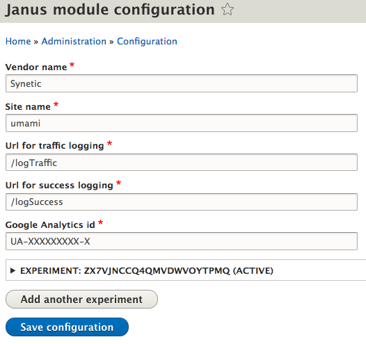

The configuration page allows us to configure the following things:
- The vendor name
- The site name
- POST urls for logging success and traffic events
- The Google Universal Analytics id.
- Experiments

Lets take a closer look at these, starting with the vendor and site name.

#### Vendor- and site
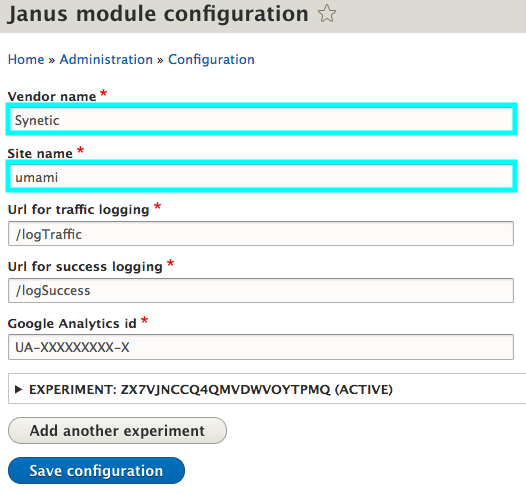

These names are used in combination with the active experiment id to form the
unique cookie name for your website and experiment.

This uses the following formats:
`vendorName_siteName_experimentId` for the cookie that stores which variation was presented to the user.
`vendorName_siteName_experimentId_ID` for the cookie that stores
the random id given to each user for returning analytic requests.

It is recommended to just leave the vendor name as it is, unless you're a company that
would like their customer's sites to show their own name in the cookie.
The site name is self explanatory as to what it should contain.
Note, this field can **not** contain special characters, as these are not capable of being saved
as a cookie by PHP. Special characters will be converted into underscores ( `_` ).
Thus, `synetic.nl` will be converted into `synetic_nl` when setting the cookie.

#### Logging URL, traffic and success  
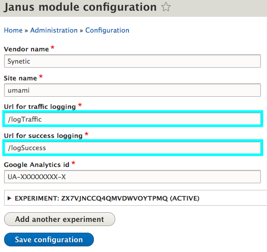

These urls are used to save data when we trigger traffic or succes events for an experiment's variation. 
The urls can be either internal urls, or to a fully formed url including protocol and hostname.

Examples of valid urls are:  
`/logSuccess`, an internal route. Will send requests to: `localhost/logSuccess`.  
`https://my-storage-site/log-success-now`, sends data to that exact route. 

The validation for these fields enforces that the url must start with either a `/` or `http`. 
Any other formats are not supported out of the box.   

#### Google Analytics tracking id
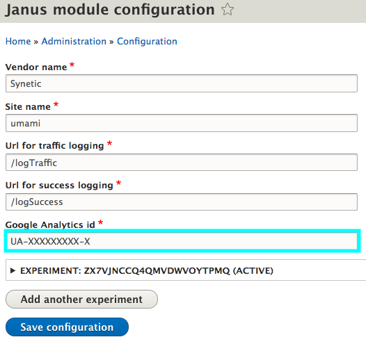  
The tracking id is the id found for your specific instance of Google Universal Analytics. 
This id is used to send the data to your Google Analytics, and not someone else's.  
Information about the location of this id within Google Analytics is found in the next chapter of this document.

#### Experiments
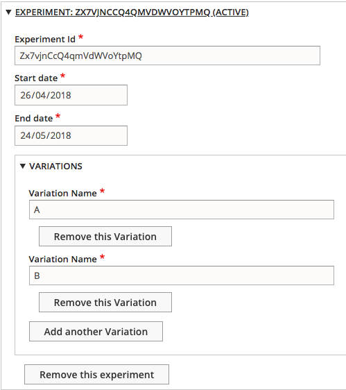

The experiment part of the configuration lets you configure all the relevant information about a single experiment.   
Adding multiple experiments, and removing old experiments is possible.  
Lets take a look at the structure of an experiment within the module.

**Id**  
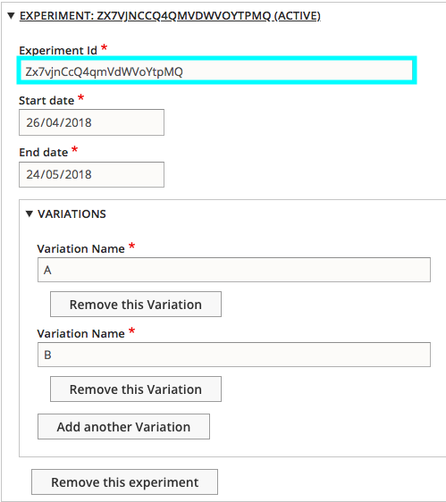

The experiment Id is what uniquely identifies the experiment. In this case it is matched with the experiment id 
created by Google Optimize, found in the experiment details here:

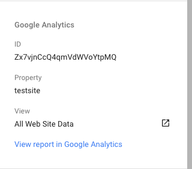

The id is saved as a string internally, as Google's ids are strings.

**Start- and end date**  
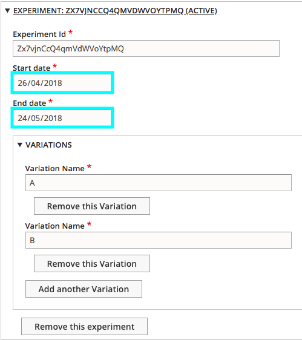

The start and end dates are what dictate if the experiment is currently active or not.  
There are several rules that must be adhered to when configuring these dates. 

1. Start date must always be before end date    
This is obvious. We can't start after ending our experiment.
2. No experiments may overlap  
Due to the concerns related to properly running experiments and cross contamination as described above, it is not possible
to run concurrent experiments.

**Variations**  
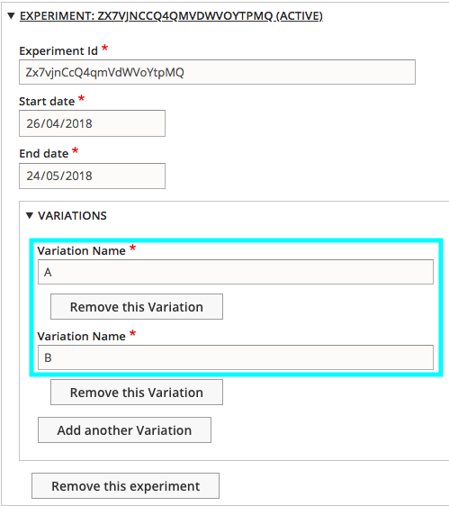  

Each experiment requires at least one variation to work. This limit is set to one to support AA-tests. 
The variations only require a name. What this name is, doesn't really matter, as the internal id is used instead.
Your control, or original, **must** be the first variation defined when using Google Analytics as a storage method.
These internal ids are numeric and increment by 1, starting from 0. However, the data type is a string to work with 
Google Analytic's specifications.

There is no limit to the amount of variations, but you should take into account the traffic your site gets when deciding 
on the amount of variations you create. Because users are split equally across variations, if your site only gets 100
users a week, it may take a long time for the test to become significant enough for use in decision making.

### Google Analytics / Google Optimize
To make sure our data collection in Google Analytics works we will have to configure some information.
As we're making use of the [measurement API](https://developers.google.com/analytics/devguides/collection/protocol/v1/) 
to send our traffic data, we do not need to worry about authenticating using OAuth. 
However, we do need to add a goal in google Analytics that allows us to trigger site hits.  
This is done in the admin panel.  
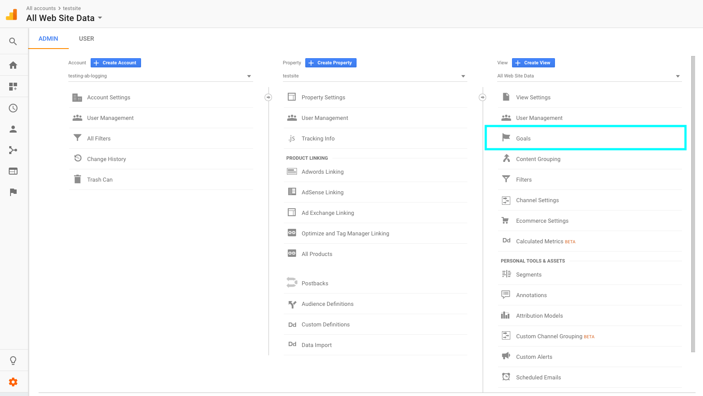

Click the "New Goal" button highlighted here.  
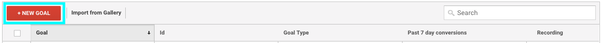

Step one will be to select a custom goal. If your Google Analytics property does not have
an industry set, this view may not appear, and you can proceed to step two.  
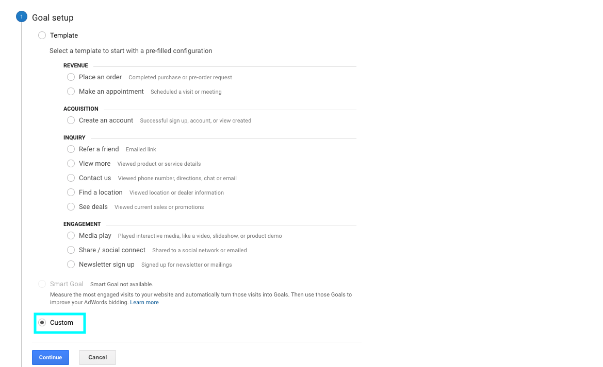  
Select the custom goal and click "Continue".

Step two here will be to create a goal with the goal type "Event" like so:  
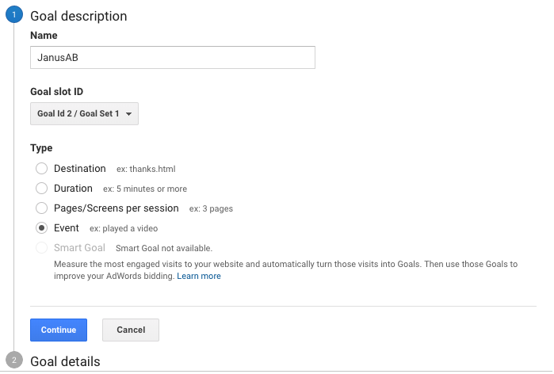  
The goal name isn't relevant, but you should probably name it something descriptive as to what it does.

The goal details are much more important. We want our event to represent the success hit, so we configure it as follows:
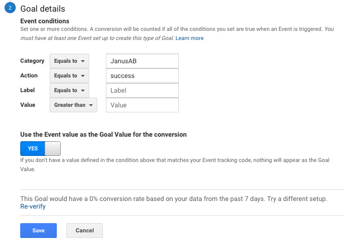  
If the category and action are not configured properly, the data we send will not be properly tracked, and every
send event will be marked as traffic, so make sure this is done correctly.

**Set the category to "JanusAB", and the action to "success"!** 

Any event send to Google Analytics by this module will have the user agent "JanusAB - AB testing", allowing one to
exclude this from measurements if needed.
 
## Rendering options
With our configuration complete, we can move on to making use of the module in our themes and modules.  
The first step will be to render our variations, as this allows them to be presented to the user.  
There are a few ways we can do this, and the choice is yours.

### Hooks
The first things we can do is vary our complete templates by variation. We do this by making use of 
the "theme suggestions" hooks from the theme api.
- [hook_theme_suggestions_alter](https://api.drupal.org/api/drupal/core%21lib%21Drupal%21Core%21Render%21theme.api.php/function/hook_theme_suggestions_alter/8.5.x)
- [hook_theme_suggestions_HOOK_alter](https://api.drupal.org/api/drupal/core%21lib%21Drupal%21Core%21Render%21theme.api.php/function/hook_theme_suggestions_HOOK_alter/8.5.x)
- [hook_theme_suggestions_HOOK](https://api.drupal.org/api/drupal/core%21lib%21Drupal%21Core%21Render%21theme.api.php/function/hook_theme_suggestions_HOOK/8.5.x)

The idea with using these hooks is that we add custom twig templates named after the variation.  
So our basic `page.html.twig` is expanded upon with a new template for each of our variations.  
`page--0.html.twig`, `page--1.html-twig`, etc. You should decide on these names yourself. It may be preferred to add some 
information to the name such as `page--janus--0`

The template folder for page templates in your theme will look a little like this:  
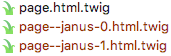

Putting this into practice, 
we may write the following implementation of `hook_theme_suggestions_HOOK_alter` in our theme:
```php
function mytheme_theme_suggestions_page_alter(array &$suggestions, array $variables) {
  // Get our services from the service container.
  // Specifically, we get the config to check for our active experiments, and the variation picker to pick variations.
  $abConfig        = \Drupal::service('janus_ab.ab_config');
  $variationPicker = \Drupal::service('janus_ab.variation_picker');
  // If there is no experiment with our specific id, we should not add any variation templates.
  if (!$abConfig->hasActiveExperimentWithId('UA-experiment-id')) {
    return [];
  }
  // Get the active experiment, because we know it exists.
  $experiment = $abConfig->getActiveExperimentById('UA-experiment-id');
  // Pick a variation, the variationPicker internals will ensure that this is the correct variation for each user.
  $variation = $variationPicker->pickVariationForExperiment($experiment);

  // Add our variation template to the array of existing suggestions.
  $format = 'page__janus_%s';
  $suggestions[] = sprintf($format, $variation->getId());
}
```
Similar code can be implemented for different hooks and pages.  
Note that this will add a suggestion for the rendering engine to use. 
If the templates do not exist, the default template, `page.html.twig`, will be rendered.  
You are responsible for adding the logic dictating whether or not a variation should be rendered in the first place.   
Examples of possible factors may be: Node id, page url, user information, etc.

### Twig
Creating full templates may be a little overkill when we're looking to make simple changes such as button sizes.  
This is why the module comes with a Twig extension that exposes 
the `hasActiveExperimentWithId`, `getActiveExperimentById`, and `pickVariation` functions in Twig templates.

Here, we vary the header that is included into the page based on the variation we choose.
```php twig
    {# Only do anything when the experiment exists. #}
    
        {# Get the experiment and variation. #}
        
        

        {# Use the chose variation to make decisions #}
        
            
        
            
        
    
```
Again, any variation logic is up to the user. 
We can not make those decisions for you, only provide examples on how to do basic rendering.

## Measurements
Now that we can render, we need to make sure that our variations are actually measured. 
We need data to make a decision after all.  
There are two main ways of sending measurements.  
By injecting JavaScript snippets on the correct pages, or by using Guzzle to send correct client requests.

Both methods make use of the configured traffic- and success urls to do their request.

### JavaScript rendering
To render correct the required JavaScript, we must attach libraries to our render arrays.
The basic process is outlined in [this stylesheet and js guide](https://www.drupal.org/docs/8/creating-custom-modules/adding-stylesheets-css-and-javascript-js-to-a-drupal-8-module)  
As our library attaching always requires the same drupal settings, with some small variations. We recommend you make use 
of the `LibraryAttacher` class.  
This class exposes a few utility methods that can be used to attach the correct libraries.   
There are four types of javascript libraries that can be used for sending measurements.  
- Basic traffic  
This library, attached by the `attachTrafficLibraryForExperimentId` function, renders a JavaScript snippet that sends a
"fire-and-forget" AJAX request to the configured traffic url.
- Basic success  
This library, attached by the `attachSuccessLibraryForExperimentId` function, renders a JavaScript snippet that sends a
"fire-and-forget" AJAX request to the configured success url.
- Event based traffic
This library, attached by the `attachTrafficEventLibraryForExperimentId` function, 
renders a JavaScript snippet that sends a "fire-and-forget" AJAX request to the configured traffic url 
when the passed event for the passed JQuery selector is triggered.  
E.g. "click" event on the "body" selector.
- Event based success
This library, attached by the `attachSuccessEventLibraryForExperimentId` function, 
renders a JavaScript snippet that sends a "fire-and-forget" AJAX request to the configured success url 
when the passed event for the passed JQuery selector is triggered.  
E.g. "click" event on the "body" selector.

#### From hooks
We can implement this from any hooks that allow us to interact with a render array.  
For example: In the [template_preprocess_page](https://api.drupal.org/api/drupal/core%21includes%21theme.inc/function/template_preprocess_page/8.5.x)
hook.  
```php
function mytheme_preprocess_page(array &$variables) {
  // Get our services from the service container.
  $attacher = \Drupal::service('janus_ab.library_attacher');
  // Attach the library if possible.
  $variables = $attacher->attachTrafficLibraryForExperimentId(
    $variables,
    'UA-experiment-id'
  );
}
```

#### From Twig
The same functions found in the `LibraryAttacher` are also exposed for Twig through the `JanusExtension`.  
The only difference here is that there is no `$variables` argument, as the rendering is done at a later stage than 
is usually done. 
```php twig
{# attach traffic JavaScript from Twig! #}
{{ attachTrafficLibraryForExperimentId('UA-experiment-id') }}
```
### PHP requests
The other way to handle success is when there is either no success page to render, or when the event may happen before 
an actual page is rendered, thus giving users a chance to get away from the site before the success rendering happens.
In each case, we still want to be capable of logging requests.

Within the module, this is done by using the `JanusRequestHandler` class.  
This class wraps around two kinds of Guzzle POST requests, leaving the creation of Guzzle requests to the handler
instead of forcing the user to recreate the same Guzzle requests whenever they wish to log success.

Implementation of this looks a little like this: 
```php
  // Get services, check if the experiment exists.
  $abConfig = \Drupal::service('janus_ab.ab_config');
  if (!$abConfig->hasActiveExperimentWithId('UA-experiment-id')) {
    return;
  }
  $variationPicker = \Drupal::service('janus_ab.variationPicker');
  $requestHandler  = \Drupal::service('janus_ab.request_handler');

  // Get the experiment, variation, and totally not fake user id.
  $experiment = $abConfig->getActiveExperimentWithId('UA-experiment-id');
  $variation  = $variationPicker->pickVariationForExperiment($experiment);
  $userId     = 'Really unique user id!';
  // Log a "traffic" event to the backend.
  $requestHandler->doTrafficRequest($experiment, $variation, $userId);
```

**Note: due to the lack of "fire-and-forget" in PHP, this is a sync request!**

## Caching
Since we are creating variations, we are going to run into caching issues.  
Our variations live on the same URL, thus they would usually be cached under the same cache key. This would mean that 
only the first user that hits the site is actually presented with a chosen variation. Any users after this will be 
presented with the same variation the first user got until caches expire.  
This is of course unacceptable. 

To solve the issue of Drupal internal caching, two additional modules come bundled into the repository, to be turned on 
depending on which internal caches are active.
### Render Cache Module
For the [Render Page Cache](https://www.drupal.org/docs/8/api/render-api/cacheability-of-render-arrays) we offer the
creatively named Janus Render Cache module. This module does one thing, which is overwrite the render cache service with its own extension that is capable of doing AB-tests.
This cache is almost always active, and is used by the Dynamic Page Cache.

**Turn this on when you are using the render cache! \(Almost always)**
 
### Page Cache Module
Similarly, to the Janus Render Cache module, the Janus Page Cache Module overwrites the 
[Internal Page Cache](https://www.drupal.org/docs/8/core/modules/page-cache) to let it work for AB-tests.

**Turn this on when you are using the internal page cache!**
### Varnish

There is currently some Varnish support, found [here](VARNISH.md).
This is not complete support, and it's not as nice as we would like it to be,
so any other solutions are welcome!

## Bots and Crawlers
For SEO purposes, it tends to be preferred to remove any bots and crawlers from any AB-tests.
To do this, the module ships with a different VariationPicker than the janus-ab-lib. This module
uses the [JayBizzle/CrawlerDetect](https://github.com/JayBizzle/Crawler-Detect) PHP library to always serve
the control variation to bots. This will ensure that SEO is not impacted by running AB-tests, as the site will not
change for bots and crawlers.

## Data storage
Currently, data is only send to Google Analytics, this is because this was the minimum requirement we set up for the 
module. 

If you would like to extend this, 
simply create an implementation of the `Synetic\JanusAB\DataStorage\DataStorageHandlerInterface` and make sure it is a 
service with a tag name `janus_ab.data_storage_handler`.

## GDPR DISCLAIMER
Note that this module uses analytical cookies. These require explicit consent for use before being allowed
to place them.

The module does **not** handle this consent for you. The way this consent will be handled for Drupal is still
unclear at the time of writing, so any cookie related logic should be implemented by the implementer.

If you are not sure about what this disclaimer means, read more about the GDPR [here](https://gdpr-info.eu/)
