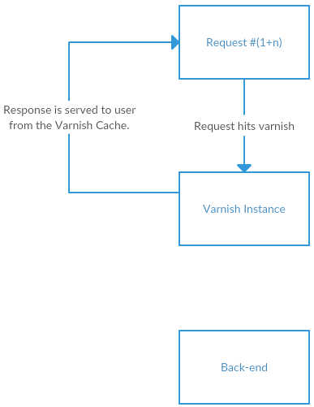

# Using JanusAB with Varnish
If you make use of the [Varnish](https://varnish-cache.org/) reverse HTTP proxy cache, 
using the JanusAB framework requires an additional step. Ordinarily, activating experiments
would create a "Vary" header that varies based on cookies.   
Because one of the framework's cookies is different for each visitor, this makes the addition
of a proxy http cache useless.  

This issue is currently not completely solved, but a small step in the right direction can be
taken by adding the following to your vcl file:  

In vcl\_recv:
```C
  # Check for JanusAB test cookies, if they exist, remove the unique id one.
  if (req.http.Cookie ~ "([!-~]*)(_)([!-~]*)(_)([!-~]*)(=)([!-~]*)" &&
    req.http.Cookie ~ "([!-~]*)(_)([!-~]*)(_)([!-~]*)(_)(ID)(=)([!-~]*)") {
    set req.http.X-JANUS-EXPERIMENT-COOKIE = regsuball(
      req.http.Cookie,
      "([!-~]*)(_)([!-~]*)(_)([!-~]*)(_)(ID)(=)([!-~]*)",
      ""
    );
  } else {
    set req.http.X-JANUS-EXPERIMENT-COOKIE = "-1";
  }
```  
And in vcl\_hash: 
```C
  hash_data(req.http.X-JANUS-EXPERIMENT-COOKIE);
  unset req.http.X-JANUS-EXPERIMENT-COOKIE;
```

This solution will ensure that the following flow
occurs for the first user to hit the site:

  
The intitial request for the first user will not be cached yet.
Because the user also does not have their cookies set yet, the 
back-end response will contain several "Set-Cookie" headers.  

Because of these headers, the Varnish cache will not cache this 
response. If it were to cache the response, the user specific
cookies would be set for every user that is served the cached 
response.  

The response is passed to the user, presenting them with HTML and
setting the correct cookies in their browser.

  
The second request looks a lot like the first request for this user.
Because there still is no cached page, the user's request hits the 
back-end. There is no "Set-Cookie" header that needs to be set, as the user
already has their cookies configured. The back-end response is cached by Varnish,
and will be served on the next request with the same request hash.  
 
  
From the third request untill the cache is invalidated, the user can be
presented with the cached response.


Any user that hits the page after the User #1 will have a different flow.  
The request-response flow for User(s) #(1+n) looks like this:


  
The first request is the exact same as those for the first user. 
Because the user does not have cookies set, they must hit the back-end to 
be given the correct variation for the experiment.

  
Any request after the first request can make use of the response that was 
cached for the first user to hit the page. This means that there is no additonal step
where the 1+nth user has their cookies set, but can't be offered information from
the cache.


This is of course not an ideal situation because each user **MUST** hit the back-end at
least once. This should be expanded upon with a VMOD targeting the correct Varnish version
for your environment.

