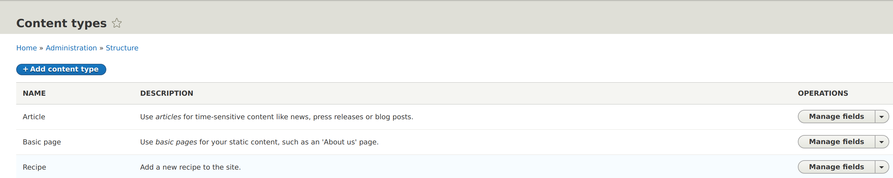
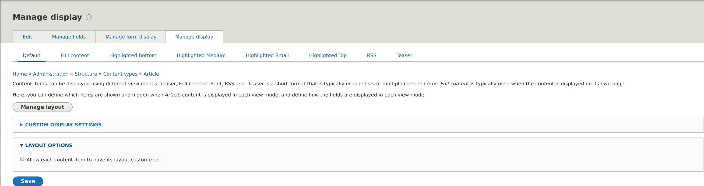
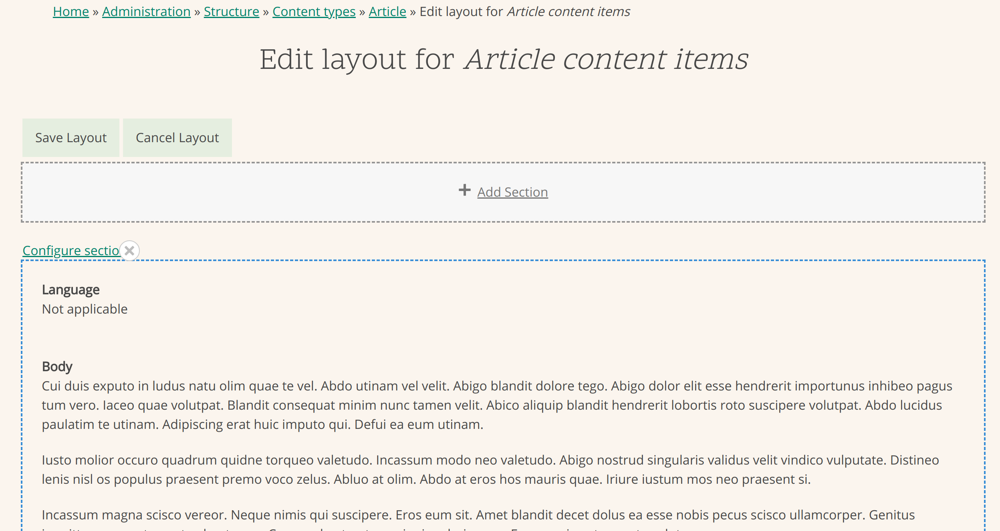
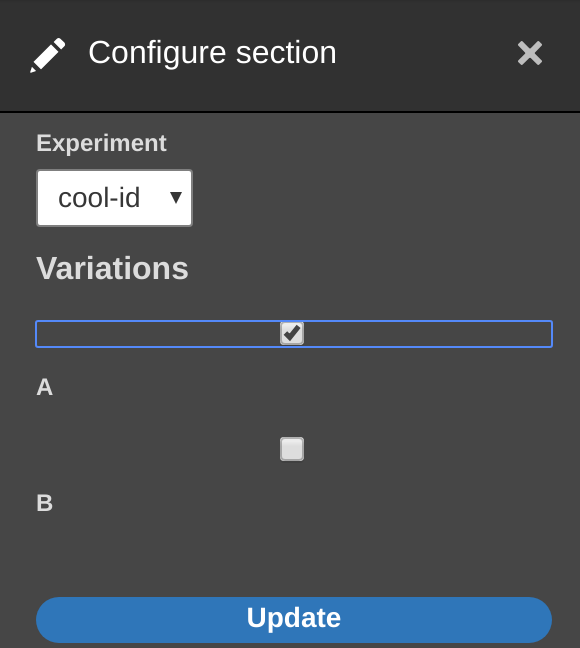

# Janus Layout Builder 
This extension on the experimental LayoutBuilder module allows for user configured AB-testing
with the JanusAB framework. 

## Developers
From a developer perspective, this module works by overriding the `LayoutBuilderEntityViewdDisplay`
and `LayoutDefault` classes. 

The `LayoutDefault` class is overridden to add a plugin based form to the layout which
allows the user to choose from a list of experiments.
These experiments are then saved as part of each `Section`'s `layout_settings`.

This implementation means that developers will need to have their custom layout 
classes extend the `JanusABConfigLayout`. This might add a bit of extra work, 
especially when one is working with contrib modules that add layouts for the layout builder.

A solution exists for this, but it is not preferred as it requires use of 
`\Reflection` to access protected class variables.

This is done by implementing  hooks in a custom module that is weighted
heavier than this module(>10).

These implementing hooks should make use of Reflection to access the main form's `$this->sectionStorage`
and `$this->delta` variables.
These will allow you to access the correct Section within the context of the config form.
A custom submit handler can be then be created that uses these to overwrite the section at the correct
`$this->delta` to add JanusAB configuration.

## UI configuration
First, see the readme of the `janus_ab` module for information about the configuration of 
the JanusAB framework. Once that is done, take a look at the LayoutBuilder documentation
for the basics of configuring a layout builder based layout.

First, head over to the content types page.

Going to the `Manage Display` operation, the following view is shown:

Here, we navigate to the display that we want to change, and press the `Manage layout` button.
We're presented with the following view that shows the current layout of the display.

Here, we can click the `configure section` button for any existing section, or simply create a new section to bring up the following sidebar form.

Here, we are presented with a dropdown box that gives the option to configure variations for each experiment. 
This involves selecting one of the experiments from the dropdown box, and then selecting the variations in which the section should be displayed.

A `default` object exists, which signals that the setction should be displayed regardless of experiment.

If an experiment is selected, the section will **only** be displayed when the selected experiment is active. 

Because this module is based on an experimental module, everything in it is subject to change. Use at your own risk! 
